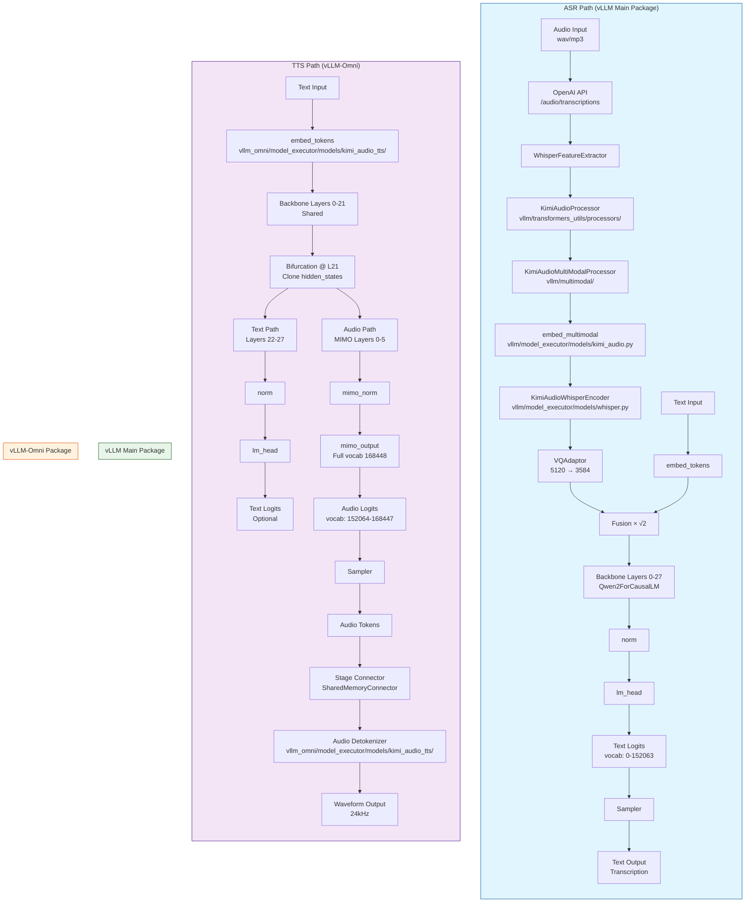

# Kimi-Audio vLLM-Omni Integration - Complete Architecture

## Overview

This document clarifies how the vLLM-Omni structure completes the Kimi-Audio integration for **both ASR (speech-to-text) and TTS (text-to-speech)**.

---

## 🏗️ Complete Integration Architecture

```
┌─────────────────────────────────────────────────────────────────────────────┐
│                         Kimi-Audio Full Pipeline                             │
│                                                                              │
│  ┌────────────────────┐                    ┌────────────────────┐          │
│  │   ASR (Existing)   │                    │   TTS (New - Omni) │          │
│  │   Speech → Text    │                    │   Text → Speech    │          │
│  │   vLLM main pkg    │                    │   vLLM-Omni        │          │
│  └────────────────────┘                    └────────────────────┘          │
└─────────────────────────────────────────────────────────────────────────────┘
```

---

## 📊 Complete Flow Diagram



---

## 📁 File Structure Mapping

### ASR Integration (vLLM Main Package - `/root/learning/vllm/`)

```
vllm/
├── model_executor/
│   └── models/
│       └── kimi_audio.py              # KimiAudioForConditionalGeneration (ASR-only)
│                                        # - Loads backbone layers 0-27
│                                        # - Loads VQAdaptor
│                                        # - SKIPS MIMO layers, mimo_output, audio_detokenizer
│       └── whisper.py                 # WhisperEncoder (extended by KimiAudio)
├── transformers_utils/
│   └── processors/
│       └── kimi_audio.py              # KimiAudioProcessor
├── tokenizers/
│   └── kimi_audio.py                  # KimiAudioTokenizer (TikToken)
├── multimodal/
│   └── processing/
│       └── processor.py               # BaseMultiModalProcessor
└── entrypoints/
    └── openai/
        └── speech_to_text/
            └── serving.py             # OpenAI-compatible STT API
```

**Key Point:** ASR integration is **COMPLETE** in vLLM main package, but **only handles speech-to-text**.

---

### TTS Integration (vLLM-Omni - `/root/learning/vllm-omni/`)

```
vllm_omni/
├── model_executor/
│   ├── models/
│   │   └── kimi_audio_tts/            # NEW: TTS implementation
│   │       ├── __init__.py
│   │       ├── configuration_kimi_audio_tts.py    # KimiAudioTalkerConfig
│   │       ├── kimi_audio_talker.py               # KimiAudioTalkerForConditionalGeneration
│   │       │                                      # - Backbone layers 0-21
│   │       │                                      # - Bifurcation @ L21
│   │       │                                      # - Text path: layers 22-27
│   │       │                                      # - Audio path: MIMO 0-5
│   │       │                                      # - mimo_output (full vocab)
│   │       ├── kimi_audio_code2wav.py             # KimiAudioCode2Wav
│   │       │                                      # - Loads audio_detokenizer/model.pt
│   │       │                                      # - Decodes audio tokens → 24kHz waveform
│   │       └── audio_detokenizer_loader.py        # Decoder architectures
│   │
│   ├── stage_configs/
│   │   └── kimi_audio_tts.yaml        # 2-stage pipeline config
│   │                                    # Stage 0: Talker (AR)
│   │                                    # Stage 1: Code2Wav (Non-AR)
│   │
│   └── stage_input_processors/
│       └── kimi_audio_tts.py          # talker2detokenizer_async_chunk
│                                        # - Handles chunked audio token streaming
│                                        # - Left context overlap
│
├── core/
│   └── sched/
│       ├── omni_ar_scheduler.py       # Auto-regressive scheduler (Stage 0)
│       └── omni_generation_scheduler.py  # Generation scheduler (Stage 1)
│
├── engine/
│   ├── __init__.py                    # OmniEngineCore
│   ├── input_processor.py
│   └── output_processor.py
│
└── distributed/
    └── omni_connectors/
        └── shm_connector.py           # SharedMemoryConnector
                                        # - Stage 0 → Stage 1 data flow
                                        # - codec_chunk_frames: 25
                                        # - codec_left_context_frames: 25
```

**Key Point:** TTS integration is **NEW** in vLLM-Omni, handles **text-to-speech** with 2-stage pipeline.

---

## 🔄 How They Connect

### Unified Model Loading

```python
# ASR Mode (vLLM main)
from vllm import LLM

llm = LLM(
    model="/data1/moonshotai/Kimi-Audio-7B-Instruct",
    task="automatic_speech_recognition",
)
# Uses: vllm/model_executor/models/kimi_audio.py
# Loads: Backbone + VQAdaptor (SKIPS MIMO)
# Output: Text transcription
```

```python
# TTS Mode (vLLM-Omni)
from vllm_omni.engine import OmniEngineCore

engine = OmniEngineCore(
    model="/data1/moonshotai/Kimi-Audio-7B-Instruct",
    stage_configs_path="vllm_omni/model_executor/stage_configs/kimi_audio_tts.yaml",
    task="text_to_speech",
)
# Uses: vllm_omni/model_executor/models/kimi_audio_tts/
# Loads: Backbone + MIMO layers + audio_detokenizer
# Output: 24kHz audio waveform
```

---

## 🎯 Weight Loading Comparison

| Component | ASR (vLLM) | TTS (vLLM-Omni) |
|-----------|------------|-----------------|
| **embed_tokens** | ✅ Loaded | ✅ Loaded |
| **Layers 0-21** | ✅ Loaded | ✅ Loaded |
| **Layers 22-27** | ✅ Loaded | ✅ Loaded |
| **norm** | ✅ Loaded | ✅ Loaded |
| **lm_head** | ✅ Loaded | ✅ Loaded (text path) |
| **VQAdaptor** | ✅ Loaded | ⚠️ Optional (for ASR+TTS unified) |
| **mimo_layers** | ❌ SKIPPED | ✅ Loaded |
| **mimo_norm** | ❌ SKIPPED | ✅ Loaded |
| **mimo_output** | ❌ SKIPPED | ✅ Loaded (full vocab) |
| **audio_detokenizer** | ❌ Not present | ✅ Loaded from model.pt |

---

## 🛠️ Registry Entries

### vLLM Main Package (`vllm/model_executor/models/registry.py`)

```python
"MoonshotKimiaForConditionalGeneration": (
    "kimi_audio",
    "KimiAudioForConditionalGeneration",
),
# Used for ASR only
```

### vLLM-Omni (`vllm_omni/model_executor/models/registry.py`)

```python
"KimiAudioTalkerForConditionalGeneration": (
    "kimi_audio_tts",
    "kimi_audio_talker",
    "KimiAudioTalkerForConditionalGeneration",
),
"KimiAudioCode2Wav": (
    "kimi_audio_tts",
    "kimi_audio_code2wav",
    "KimiAudioCode2Wav",
),
# Used for TTS pipeline
```

---

## 📈 Execution Flow

### ASR (Speech-to-Text)

```
1. User sends audio via OpenAI API /audio/transcriptions
2. vLLM entrypoints/openai/speech_to_text/serving.py receives request
3. WhisperFeatureExtractor extracts features [B, S, 5120]
4. KimiAudioProcessor processes features + text
5. VQAdaptor projects: 5120 → 3584
6. Fusion: (audio + text) × √2
7. Backbone layers 0-27 process
8. norm + lm_head → text logits
9. Sampler → text tokens
10. Tokenizer.decode → transcription text
```

### TTS (Text-to-Speech) - vLLM-Omni

```
STAGE 0 (Talker):
1. User sends text prompt
2. OmniEngineCore receives request
3. embed_tokens → text embeddings
4. Backbone layers 0-21 (shared)
5. Bifurcation @ L21: clone hidden_states
6. Text path: layers 22-27 (optional, for unified model)
7. Audio path: MIMO layers 0-5
8. mimo_norm + mimo_output → audio logits [full vocab]
9. Slice logits[152064:168448] → audio tokens
10. Sampler → audio token IDs
11. SharedMemoryConnector streams tokens to Stage 1

STAGE 1 (Code2Wav):
12. Receive audio tokens from connector
13. audio_detokenizer/model.pt decodes tokens
14. Output: 24kHz waveform
15. Return audio to user
```

---

## 🔧 Configuration Files

### ASR (vLLM)

No special config needed - uses standard vLLM engine args:

```python
from vllm import LLM, SamplingParams

llm = LLM(
    model="/data1/moonshotai/Kimi-Audio-7B-Instruct",
    trust_remote_code=True,
)

sampling_params = SamplingParams(
    max_tokens=512,
    temperature=0.0,
)

outputs = llm.generate(
    prompts=[{"audio": audio_file, "text": "Transcribe:"}],
    sampling_params=sampling_params,
)
```

### TTS (vLLM-Omni)

Requires stage configuration:

```yaml
# vllm_omni/model_executor/stage_configs/kimi_audio_tts.yaml
async_chunk: true
stage_args:
  - stage_id: 0  # Talker
    engine_args:
      model_stage: kimi_audio_talker
      model_arch: KimiAudioTalkerForConditionalGeneration
      gpu_memory_utilization: 0.5
      max_model_len: 4096
      
  - stage_id: 1  # Code2Wav
    engine_args:
      model_stage: kimi_audio_code2wav
      model_arch: KimiAudioCode2Wav
      gpu_memory_utilization: 0.3
      max_model_len: 32768
    input_connectors:
      from_stage_0: connector_of_shared_memory
```

---

## 🧪 Testing Commands

### Test ASR (vLLM)

```bash
python -c "
from vllm import LLM
llm = LLM(model='/data1/moonshotai/Kimi-Audio-7B-Instruct', task='automatic_speech_recognition')
print('✅ ASR model loaded')
"
```

### Test TTS (vLLM-Omni)

```bash
python -c "
from vllm_omni.model_executor.models.kimi_audio_tts import KimiAudioTalkerForConditionalGeneration, KimiAudioCode2Wav
print('✅ TTS models imported')
print('✅ KimiAudioTalkerForConditionalGeneration')
print('✅ KimiAudioCode2Wav')
"
```

```bash
cd /root/learning/vllm-omni/examples/offline_inference/kimi_audio_tts
bash run_single_prompt.sh
```

---

## 📋 Integration Status

| Component | Status | Location |
|-----------|--------|----------|
| **ASR Model** | ✅ Complete | `vllm/model_executor/models/kimi_audio.py` |
| **ASR Processor** | ✅ Complete | `vllm/transformers_utils/processors/kimi_audio.py` |
| **ASR Tokenizer** | ✅ Complete | `vllm/tokenizers/kimi_audio.py` |
| **ASR API** | ✅ Complete | `vllm/entrypoints/openai/speech_to_text/` |
| **TTS Talker** | ✅ Complete | `vllm_omni/model_executor/models/kimi_audio_tts/kimi_audio_talker.py` |
| **TTS Code2Wav** | ✅ Complete | `vllm_omni/model_executor/models/kimi_audio_tts/kimi_audio_code2wav.py` |
| **TTS Stage Config** | ✅ Complete | `vllm_omni/model_executor/stage_configs/kimi_audio_tts.yaml` |
| **TTS Stage Processor** | ✅ Complete | `vllm_omni/model_executor/stage_input_processors/kimi_audio_tts.py` |
| **TTS Registry** | ✅ Complete | `vllm_omni/model_executor/models/registry.py` |
| **TTS Examples** | ✅ Complete | `examples/offline_inference/kimi_audio_tts/` |
| **Audio Detokenizer** | ⚠️ Needs verification | `/data1/moonshotai/Kimi-Audio-7B-Instruct/audio_detokenizer/model.pt` |

---

## 🎯 Summary

**vLLM Main Package:**
- ✅ ASR (Speech-to-Text) - **COMPLETE**
- ❌ TTS (Text-to-Speech) - **NOT implemented**

**vLLM-Omni:**
- ❌ ASR (Speech-to-Text) - **Not needed** (already in vLLM)
- ✅ TTS (Text-to-Speech) - **COMPLETE** (new implementation)

**Together:**
- ✅ **Full Kimi-Audio support** (ASR + TTS)
- ✅ **OpenAI-compatible APIs** (STT + TTS)
- ✅ **High-performance inference** (vLLM + vLLM-Omni pipelines)

---

**Documentation Date:** 2026-03-12  
**Status:** Complete Architecture Overview ✅
