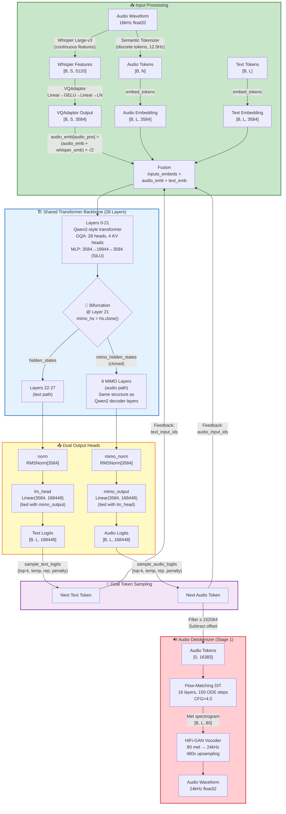

# Kimi Audio: Architecture and Inference Guide

## 1. What Is Kimi Audio?

**Kimi Audio** is a universal audio foundation model by Moonshot AI that performs audio understanding, generation, and conversation in a single model. It is trained on **13M+ hours** of diverse audio data (speech, music, sound effects, environmental sounds) and supports:

- **Audio Understanding**: Speech recognition (ASR), audio captioning, sound event detection, speaker identification
- **Audio Generation**: Text-to-speech (TTS), sound effect generation, music generation
- **Audio Conversation**: Multi-turn dialogue with mixed audio/text input and output
- **Streaming**: Real-time chunk-wise generation for low-latency interaction

The model is **not** just an ASR model — it is a full audio I/O system that can both understand and produce speech/sound natively, without chaining separate models.

### Model Variants

| Variant | Purpose |
|---|---|
| `Kimi-Audio-7B-Base` | Base model (pretrained) |
| `Kimi-Audio-7B-Instruct` | Instruction-tuned for conversation |

### Three Main Components

```
┌────────────────────────────────────────────────────────────────────┐
│                         Kimi Audio System                          │
│                                                                    │
│  ┌──────────────────┐  ┌──────────────────┐  ┌────────────────┐  │
│  │ Audio Tokenizer  │  │    Audio LLM     │  │ Audio          │  │
│  │                  │  │                  │  │ Detokenizer    │  │
│  │ ┌──────────────┐ │  │ ┌──────────────┐ │  │                │  │
│  │ │ Whisper      │ │  │ │ Qwen2-based  │ │  │ ┌────────────┐│  │
│  │ │ Large-v3     │─┼─▶│ │ 28 layers    │─┼─▶│ │ Flow-      ││  │
│  │ │ (continuous) │ │  │ │ + 6 MIMO     │ │  │ │ matching   ││  │
│  │ └──────────────┘ │  │ │ layers       │ │  │ │ DiT (16L)  ││  │
│  │ ┌──────────────┐ │  │ │ (bifurcation │ │  │ └────────────┘│  │
│  │ │ Semantic     │ │  │ │ at layer 21) │ │  │ ┌────────────┐│  │
│  │ │ Tokenizer    │ │  │ └──────────────┘ │  │ │ HiFi-GAN   ││  │
│  │ │ (discrete)   │ │  │                  │  │ │ Vocoder    ││  │
│  │ └──────────────┘ │  │                  │  │ └────────────┘│  │
│  └──────────────────┘  └──────────────────┘  └────────────────┘  │
│                                                                    │
│  Audio → tokens + features    Tokens → text + audio tokens    Tokens → waveform
│  16kHz input                  28-layer transformer             24kHz output
│                               dual output heads                50 tokens/sec
└────────────────────────────────────────────────────────────────────┘
```

1. **Audio Tokenizer** — Converts audio waveforms into a hybrid representation:
   - **Discrete semantic tokens** (12.5 Hz token rate, from a semantic audio tokenizer)
   - **Continuous acoustic features** (Whisper Large-v3 encoder output, 5120-dim)
   - Combined via VQAdaptor into the model's input embedding space

2. **Audio LLM** — The core transformer model:
   - Based on **Qwen2-7B** architecture (28 layers, 3584 hidden size)
   - **Bifurcation** at layer 21: hidden states split into text path and audio path
   - **Text head** (`lm_head`): produces text token logits (vocab 0–152063)
   - **Audio head** (`mimo_output`): produces audio token logits (vocab 152064–168447)
   - Both heads share the same embedding weights (tied weights)

3. **Audio Detokenizer** — Converts audio tokens back to waveforms:
   - **Flow-matching DiT** (16-layer diffusion transformer, 150 ODE steps, CFG=4.0)
   - **HiFi-GAN vocoder** (upsamples mel spectrogram to 24kHz waveform)

---

## 2. Unified Vocabulary

Kimi Audio uses a **single unified vocabulary** of 168,448 tokens, split into two non-overlapping ranges:

```
┌─────────────────────────────────┬──────────────────────────────────┐
│     Text Token Range            │     Audio Token Range            │
│     [0, 152063]                 │     [152064, 168447]             │
│     152,064 tokens              │     16,384 tokens                │
│                                 │                                  │
│     Regular text tokens:        │     Audio semantic tokens:       │
│     - English/Chinese words     │     - 12.5 Hz → 50 Hz            │
│     - Special tokens            │     - 4x upsampled for           │
│     - Chat templates            │       generation (50 tok/s)      │
│                                 │                                  │
│     Decoded by:                 │     Decoded by:                  │
│     Standard text tokenizer     │     Flow-matching detokenizer    │
└─────────────────────────────────┴──────────────────────────────────┘

kimia_token_offset = 152064  ← threshold that separates text from audio
```

**Why unified vocabulary?** The model can generate both text and audio tokens from the same output heads. The text head (`lm_head`, vocab_size=168448) and audio head (`mimo_output`, vocab_size=168448) both output over the full vocabulary — the token offset separates which tokens are text vs audio.

### Audio Token Math

```
Audio token rate:  50 tokens/sec
Sample rate:       24,000 Hz
Hop size:          480 samples/token  (24000 / 50 = 480)
Duration:          num_audio_tokens / 50 seconds

Example: 250 audio tokens → 5.0 seconds of audio
```

---

## 3. Architecture Details

### 3.1 Model Config (from `config.json`)

```json
{
  "architectures": ["MoonshotKimiaForCausalLM"],
  "model_type": "moonshot_kimia",
  "hidden_size": 3584,
  "num_hidden_layers": 28,           // Main transformer layers
  "num_attention_heads": 28,
  "num_key_value_heads": 4,          // GQA (Grouped Query Attention)
  "intermediate_size": 18944,        // MLP hidden dim
  "vocab_size": 168448,              // Unified text+audio vocab
  "rms_norm_eps": 1e-06,

  "kimia_mimo_layers": 6,            // Audio-specific transformer layers
  "kimia_mimo_transformer_from_layer_index": 21,  // Bifurcation point
  "kimia_text_output_vocab": 152064, // Text token range size
  "kimia_audio_output_vocab": 16896, // Audio token range size (16384 + padding)
  "kimia_token_offset": 152064,      // Threshold: text < offset < audio
  "kimia_mimo_audiodelaytokens": 6,  // Audio starts 6 tokens after text

  "use_whisper_feature": true,       // Use Whisper encoder for audio input
  "whisper_model_name": "whisper-large-v3"
}
```

### 3.2 Transformer Architecture

```
┌─────────────────────────────────────────────────────────────────────┐
│ MoonshotKimiaModel (28 main layers + 6 MIMO layers)                 │
│                                                                     │
│  embed_tokens: nn.Embedding(168448, 3584)                          │
│                                                                     │
│  ┌─────────────────────────────────────────────────────────────┐   │
│  │  Main Transformer Layers (0-27) — Qwen2-style              │   │
│  │                                                              │   │
│  │  Layer 0 ── Layer 1 ── ... ── Layer 21 ── ... ── Layer 27 │   │
│  │                                   │                          │   │
│  │                  (GQA: 28 heads, 4 KV heads)                │   │
│  │                  MLP: 3584 → 18944 → 3584 (SiLU)           │   │
│  │                  RoPE: max_position_embeddings = 131072     │   │
│  └──────────────────────────────────┬──────────────────────────┘   │
│                                     │                               │
│                    ┌────────────────┴────────────────┐             │
│                    │  BIFURCATION @ Layer 21         │             │
│                    │  mimo_hidden_states = hs.clone()│             │
│                    └────────┬───────────────┬────────┘             │
│                             │               │                       │
│              ┌──────────────▼──┐     ┌──────▼────────────────┐    │
│              │  Text Path      │     │  Audio Path            │    │
│              │  Layers 22-27   │     │  6 MIMO Layers         │    │
│              │  (continues     │     │  (clone of Qwen2       │    │
│              │   in main       │     │   decoder layers)      │    │
│              │   backbone)     │     │                        │    │
│              └────────┬────────┘     └──────────┬─────────────┘    │
│                       │                          │                   │
│                  norm(hidden)              mimo_norm(hidden)         │
│                       │                          │                   │
│                  lm_head                    mimo_output              │
│              Linear(3584, 168448)         Linear(3584, 168448)      │
│                       │                          │                   │
│                  text_logits                audio_logits             │
│              [B, L, 168448]             [B, L, 168448]              │
└─────────────────────────────────────────────────────────────────────┘
```

**Key**: The 6 MIMO layers are structurally identical to the main Qwen2 decoder layers (same attention, MLP, RMSNorm). They have their own separate weights. They are indexed as `past_key_values[28:34]` in the KV cache (after the 28 main layers).

### 3.3 Tied Weights

```python
_tied_weights_keys = ["lm_head.weight", "mimo_output.weight"]
```

`lm_head` and `mimo_output` share the same underlying weight tensor. Both are `Linear(3584, 168448, bias=False)`.

### 3.4 Audio Detokenizer Config

**Flow-matching DiT** (`audio_detokenizer/config.yaml`):
```yaml
model:
  dit:
    hidden_size: 2304
    depth: 16               # 16 transformer layers
    num_heads: 18
    semantic_vocab_size: 16384   # Audio tokens (after offset subtraction)
    input_size: 80            # Mel spectrogram bins
    condition_input_dim: 1280
    use_rope: true
    rope_params:
      max_position_embeddings: 4096
    chunk_params:
      hz: 50                  # 50 tokens/sec
      max_chunk: 3.0          # Max 3 seconds per chunk
      min_chunk: 0.5          # Min 0.5 seconds per chunk
ode_steps: 150               # ODE integration steps (Euler method)
cfg_scale: 4.0               # Classifier-free guidance scale
```

**HiFi-GAN Vocoder** (`vocoder/config.json`):
```json
{
  "sampling_rate": 24000,
  "hop_size": 480,
  "num_mels": 80,
  "n_fft": 1024,
  "upsample_rates": [5, 2, 2, 2, 2, 3, 2],   // total: 480x
  "upsample_kernel_sizes": [9, 4, 4, 4, 4, 5, 4],
  "upsample_initial_channel": 2048
}
```

---

## 4. How Kimi Audio Performs Inference

### 4.1 Overview: The Dual Token Stream

The most critical architectural feature of Kimi Audio is that it maintains **two parallel token streams** during generation:

```
┌─────────────────────────────────────────────────────────────────────┐
│                DUAL TOKEN STREAM GENERATION                         │
│                                                                     │
│  At each generation step, the model:                                │
│    1. Takes audio_input_ids AND text_input_ids as input             │
│    2. Fuses them during embedding: audio_emb + text_emb             │
│    3. Runs forward through the transformer                          │
│    4. Produces audio_logits AND text_logits                         │
│    5. Samples next_audio_token AND next_text_token                  │
│    6. Feeds BOTH back for the next step                             │
│                                                                     │
│  This is NOT a standard AR model!                                   │
│  Standard AR: input_ids → logits → next_token → input_ids           │
│  Kimi Audio: audio_ids + text_ids → 2x logits → 2x tokens → both   │
└─────────────────────────────────────────────────────────────────────┘
```

### 4.2 Input Preparation (Prefill Phase)

Before generation begins, inputs are prepared with dual streams:

```python
# For each message in the conversation:
# - Audio content → two parallel sequences:
#   audio_stream: [media_begin, audio_token_1, ..., audio_token_N, media_end]
#   text_stream:  [blank,      blank,          ..., blank,          blank     ]
#
# - Text content → two parallel sequences:
#   audio_stream: [blank, blank, ..., blank]
#   text_stream:  [token_1, token_2, ..., token_N]
#
# - Audio delay padding:
#   audio_stream is padded with (kimia_text_audiodelaytokens=6) blanks at start
#   text_stream is padded with blanks to match lengths

# Final prefill input:
audio_input_ids  = [blank]*6 + [media_begin, audio_tokens..., media_end] + [blank]*text_len
text_input_ids   = [blank]*6 + [blank]*(N+2) + [text_tokens...]
```

**Special tokens used**:
- `<|im_kimia_text_blank|>` (id=18) — placeholder for the "other" stream
- `<|im_kimia_text_eos|>` (id=19) — signals end of text stream
- `<|im_media_begin|>` (id=13) — marks start of audio input
- `<|im_media_end|>` (id=15) — marks end of audio input
- `<|im_msg_end|>` (id=0) — marks end of a message turn

**Fusion at embedding time**:
```python
# 1. Embed audio tokens
audio_emb = embed_tokens(audio_input_ids)        # [B, L, 3584]

# 2. For audio input segments, add Whisper continuous features
#    whisper_emb = VQAdaptor(whisper_features)
#    audio_emb[audio_positions] = (audio_emb + whisper_emb) * sqrt(2)

# 3. Embed text tokens
text_emb = embed_tokens(text_input_ids)           # [B, L, 3584]

# 4. Fuse: simple addition
inputs_embeds = audio_emb + text_emb              # [B, L, 3584]
```

The `√2` scaling only applies where continuous (Whisper) features are present. For non-audio positions, it's just `audio_emb + text_emb`.

### 4.3 Generation Loop (Decode Phase)

```python
# === REFERENCE IMPLEMENTATION (kimia_infer/api/kimia.py) ===

for step in range(max_new_tokens):

    # ─── STEP 1: Forward pass with BOTH token streams ───
    audio_logits, text_logits, past_key_values = model.forward(
        input_ids=decoder_input_audio_ids,          # audio stream
        text_input_ids=decoder_input_text_ids,      # text stream
        position_ids=decoder_position_ids,
        past_key_values=past_key_values,
    )

    # ─── STEP 2: Sample BOTH next tokens ───
    next_text_token  = sample_text_logits(text_logits)    # from lm_head
    next_audio_token = sample_audio_logits(audio_logits)  # from mimo_output

    # ─── STEP 3: Handle text stream termination ───
    if text_stream_is_finished:
        next_text_token = BLANK_TOKEN        # pad with blank after EOS
    elif next_text_token == TEXT_EOS_TOKEN:
        text_stream_is_finished = True

    # ─── STEP 4: Handle audio delay ───
    # Audio tokens are delayed by 6 steps (kimia_mimo_audiodelaytokens=6)
    # First 6 steps: audio token is forced to BLANK
    if step < 6:
        next_audio_token = BLANK_TOKEN
    elif output_type == "text":
        next_audio_token = BLANK_TOKEN       # text-only mode: skip audio

    # ─── STEP 5: Check if audio stream is done ───
    audio_done = next_audio_token in [MSG_END_TOKEN, MEDIA_END_TOKEN]

    # ─── STEP 6: Termination check ───
    if (output_type == "text" and text_done) or \
       (output_type == "both" and audio_done):
        # Return collected tokens
        return audio_tokens, text_tokens

    # ─── STEP 7: Feed BOTH tokens back for next step ───
    decoder_input_audio_ids = next_audio_token.unsqueeze(1)   # [1, 1]
    decoder_input_text_ids  = next_text_token.unsqueeze(1)    # [1, 1]
    decoder_position_ids    = last_position_id + 1
```

**Critical insight**: Unlike standard AR models where only `input_ids` is fed back, Kimi Audio feeds back **two separate token IDs** at each step — one for the audio stream and one for the text stream. This is the **dual token stream** pattern.

### 4.4 Token Collection and Post-Processing

After generation, the two streams are separated and post-processed:

```python
# Text tokens: filter out BLANK tokens, decode with text tokenizer
text_tokens = [t for t in text_stream if t != BLANK_TOKEN]
text_output = tokenizer.decode(text_tokens)

# Audio tokens: filter to only audio range, subtract offset
audio_tokens = [t for t in audio_stream if t >= kimia_token_offset]  # keep ≥ 152064
audio_tokens = [t - kimia_token_offset for t in audio_tokens]         # shift to [0, 16383]
audio_tokens = torch.tensor(audio_tokens)

# Convert audio tokens to waveform via detokenizer
waveform = detokenizer(audio_tokens)  # flow-matching DiT → vocoder → 24kHz
```

### 4.5 Audio Detokenization Pipeline

```
Audio tokens [0, 16383]
         │
         ▼
┌─────────────────────┐
│  token_embed        │  nn.Embedding(16384, 2304)
│  → condition_prenet │  Linear(2304, 2304) → GELU → Linear(2304, 2304)
│                     │  Output: condition [B, L, 2304]
└─────────┬───────────┘
          │
          ▼
┌─────────────────────┐
│  Flow-Matching ODE  │  150 Euler steps
│                     │
│  For each step t:   │
│    v_cond    = DiT(noise, condition, t)         │
│    v_uncond  = DiT(noise, zeros,   t)           │
│    velocity  = v_uncond + 4.0*(v_cond - v_uncond)│  ← CFG
│    noise    += velocity * (1/150)                │  ← Euler step
│                     │
│  Output: mel [B, L, 80]                         │
└─────────┬───────────┘
          │
          ▼
┌─────────────────────┐
│  HiFi-GAN Vocoder   │  ConvTranspose1d upsampling
│  80 mel → 24kHz     │  Rates: [5,2,2,2,2,3,2] = 480x total
│                     │  Output: waveform [B, L*480]
└─────────────────────┘
```

### 4.6 Chunk-wise Streaming

Kimi Audio supports **streaming generation** by processing audio in chunks:

```
Token generation:  ──┬──┬──┬──┬──┬──┬──┬──┬──→ time
                      │  │  │  │  │  │  │  │
Chunk boundaries:  ──┴──┴──┴──┴──┴──┴──┴──┴──→
                    50  50  50  50  50  50  50  tokens
                    1s  1s  1s  1s  1s  1s  1s  seconds

Each chunk of 50 audio tokens:
  → Sent to detokenizer via SharedMemoryConnector
  → Detokenizer runs flow-matching (150 ODE steps)
  → Vocoder produces 1 second of audio (24000 samples)
  → Overlap-add with previous chunk for continuity
```

---

## 5. Architecture Diagram



---

## 6. Key Architectural Insights

### 6.1 Why Dual Token Streams?

The dual token stream design solves a fundamental problem: **text and audio are generated at different rates and have different temporal structures**.

- **Text tokens** appear at natural language pace (maybe 5-15 tokens per sentence)
- **Audio tokens** appear at 50 tokens/second continuously

By maintaining separate streams, the model can:
1. **Align text and audio** temporally (each position in the sequence has both a text token and an audio token)
2. **Handle silence/pauses** in audio with blank tokens while text continues
3. **Delay audio generation** by 6 tokens to allow the model to "plan" what to say before speaking

### 6.2 Why Bifurcation at Layer 21?

The bifurcation point is a design choice that balances **sharing** vs **specialization**:

- **Layers 0-21 (shared)**: Process both text and audio jointly — the model learns a unified representation
- **Layer 21 (clone point)**: Hidden states contain enough context to branch into modality-specific processing
- **Layers 22-27 (text-only)**: Continue processing text with the full backbone
- **MIMO layers (audio-only)**: Specialized 6 layers for audio token generation

This is more efficient than having two completely separate models, and more flexible than having a single path for both modalities.

### 6.3 Why Flow-Matching for Detokenization?

The audio detokenizer uses **flow-matching** (a type of continuous normalizing flow) rather than:

- **Autoregressive**: Too slow for real-time audio (would need to generate mel bins one by one)
- **GAN**: Hard to train, mode collapse issues
- **VAE**: Blurry outputs

Flow-matching offers:
- **Fast ODE solving**: 150 Euler steps is tractable
- **High quality**: Better than VAE, more stable than GAN
- **Classifier-free guidance**: CFG=4.0 allows trading off diversity vs quality

### 6.4 Critical Gotcha: Not a Standard AR Model

The biggest mistake when implementing Kimi Audio is treating it as a standard autoregressive model:

```
❌ WRONG: Standard AR loop
input_ids → model → logits → argmax → next_token → append to input_ids → repeat

✅ CORRECT: Dual stream loop
audio_ids + text_ids → model → (audio_logits, text_logits)
    → (next_audio, next_text) → append BOTH → repeat
```

The model's `forward()` takes **two** `input_ids` arguments: `input_ids` (audio stream) and `text_input_ids` (text stream). Both are embedded separately and added together before processing. Both sampled tokens must be fed back for the next step.

---

## 7. vllm-omni Integration

### 7.1 Current Implementation Status

| Component | Status | Notes |
|---|---|---|
| Whisper encoder + VQAdaptor | ✅ Implemented | Reused from upstream vllm |
| Input fusion (embed_input_ids) | ✅ Implemented | `audio_emb + text_emb` |
| Shared backbone (layers 0-27) | ✅ Implemented | Via `Qwen2ForCausalLM` |
| Bifurcation at layer 21 | ✅ Implemented | Clone hidden states |
| 6 MIMO layers | ✅ Implemented | Separate `nn.ModuleList` |
| `mimo_norm` (RMSNorm) | ✅ Implemented | Audio path normalization |
| `mimo_output` (audio head) | ✅ Implemented | Tied weights with `lm_head` |
| Dual token stream generation | ❌ **NOT implemented** | **Root cause of text garbage** |
| Flow-matching detokenizer | ✅ Implemented | 16-layer DiT, 150 ODE steps |
| HiFi-GAN vocoder | ✅ Implemented | 24kHz output |
| Async chunk streaming | ✅ Implemented | 50 tokens/sec, 1-second chunks |

### 7.2 The Fundamental Problem

**The current vllm-omni implementation uses vLLM's standard AR generation loop, which only feeds back text tokens.** This breaks the dual token stream requirement.

```
Current (broken):
  Step 1: forward(input_ids=text_tokens) → text_logits, audio_logits
  Step 2: text_tokens ← argmax(text_logits)     ← only text fed back!
  Step 3: audio_logits are extracted but NOT used for feedback
  Result: Text output is garbage because audio context is missing

Required (correct):
  Step 1: forward(audio_ids, text_ids) → audio_logits, text_logits
  Step 2: text_tokens ← sample(text_logits)
          audio_tokens ← sample(audio_logits)
          BOTH fed back
  Result: Both outputs are correct
```

### 7.3 What Needs to Change

To fix text output, the generation loop must be modified to:
1. Pass **both** `audio_input_ids` and `text_input_ids` to `forward()` at each step
2. Sample from both `audio_logits` and `text_logits`
3. Feed both sampled tokens back as input for the next step
4. Apply audio delay (first 6 audio tokens are blank)
5. Handle text stream termination (blank padding after EOS)

This requires either:
- A custom worker/sampler that implements the dual-stream loop
- Modifications to vLLM's generation scheduler to support multi-input feedback

---

## 8. Model Checkpoint Structure

```
/data1/moonshotai/Kimi-Audio-7B-Instruct/
├── config.json                          # Main model config
├── model-00001-of-00036.safetensors     # Main model weights (36 shards)
├── model-00002-of-00036.safetensors
├── ...
├── model-00036-of-00036.safetensors
├── model.safetensors.index.json         # Weight index
├── tokenizer files...
│
├── audio_detokenizer/
│   ├── config.yaml                      # Flow-matching DiT config
│   └── model.pt                         # DiT weights (~19GB)
│
├── vocoder/
│   ├── config.json                      # HiFi-GAN config
│   └── model.pt                         # Vocoder weights (~964MB)
│
└── whisper-large-v3/                    # Whisper encoder (reused)
    └── ...
```

### Weight Key Mapping

| Weight Key | Shape | Purpose |
|---|---|---|
| `model.embed_tokens.weight` | [168448, 3584] | Token embedding (shared) |
| `model.layers.{0-27}.*` | various | Main transformer layers |
| `model.norm.weight` | [3584] | Final RMSNorm (text path) |
| `lm_head.weight` | [168448, 3584] | Text output head (tied) |
| `model.mimo_layers.{0-5}.*` | various | 6 MIMO audio layers |
| `model.mimo_norm.weight` | [3584] | MIMO RMSNorm (audio path) |
| `mimo_output.weight` | [168448, 3584] | Audio output head (tied) |
| `model.vq_adaptor.*` | various | VQAdaptor (Whisper→hidden) |

---

## 9. Reference Implementation

The official inference code is at `/root/learning/Kimi-Audio/kimia_infer/`:

| File | Purpose |
|---|---|
| `api/kimia.py` | Main `KimiAudio` class with `_generate_loop()` |
| `api/prompt_manager.py` | Dual-stream prompt construction |
| `utils/sampler.py` | `KimiASampler` with separate text/audio sampling |
| `utils/special_tokens.py` | Special token definitions |
| `models/detokenizer.py` | Audio detokenizer loading |

Key entry point for understanding inference: `kimia_infer/api/kimia.py` → `_generate_loop()` (lines 52–200).
